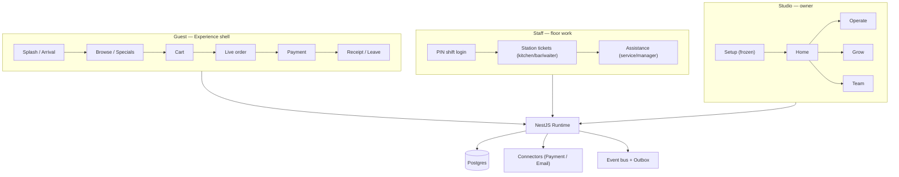
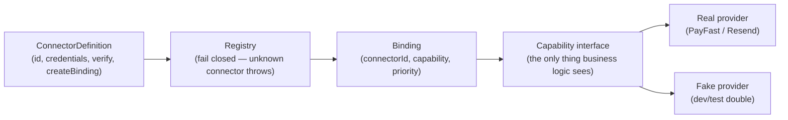
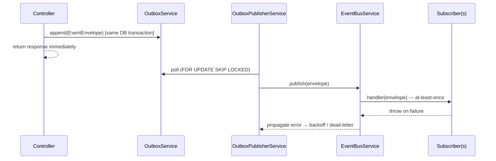

# TDD — Lekki / LEOS Platform Architecture

| Field | Value |
|---|---|
| Tech Lead | Ilse Van Zyl |
| Team | LEO (the engineering org) |
| Epic/Ticket | N/A — living architecture reference, not tied to a single delivery |
| Status | Living document — reflects the running system as of the date below |
| Created | 2026-09-22 |
| Last Updated | 2026-09-22 |

This is a **current-state architecture reference**, not a proposal. It documents what LEOS is and why it's built this way, for onboarding and for grounding future decisions — the skill's usual "new project" sections (Rollback Plan, Success Metrics, Approval & Sign-off) are reframed or omitted where they don't fit an existing system.

---

## Context

**Lekki** is the company. **LEOS** (Lekki Experience Operating System) is the platform it builds. Restaurants are the first Pack LEOS ships — not the product identity. The same runtime is meant to host hotels, cafés, festivals, airports, and healthcare waiting rooms as later Packs, without rewriting the core.

**Domain:** hospitality experience software — a guest ordering and paying at a venue, staff running the floor, and an owner setting up and later overseeing the business. Not a delivery marketplace; not a POS.

**Stakeholders:** guests (who never learn Studio exists), staff (who never walk Setup or Grow), and owners (who don't live in a kitchen tablet's chrome). Three humans, three surfaces, deliberately never sharing one portal.

---

## Problem Statement & Motivation

### The model LEOS explicitly rejects

Delivery-management platforms (Uber Eats Manager is the reference point this session used repeatedly) assume courier logistics — orders in, kitchen out, KPIs, a multi-panel admin "control room." That model fits "manage a queue of remote orders." It does not fit LEOS's actual shape: **the guest is already at the venue, the place owns the visit, and software should feel like it's hosting three humans, not running a queue.**

### Why this matters now

- **Product identity risk**: without a firm stance, every new capability request (a dashboard here, a report there) pulls the product toward the delivery-control-room model by default — the direction every "add a Reports tab" or "add an Analytics screen" instinct points.
- **Trust risk**: an owner who goes live and then finds zero visibility into money (do I get paid? is anything failing right now?) has a real reason to stop trusting the platform with revenue — this isn't cosmetic, it's retention-critical.
- **Cognitive load as the actual competitor**: the product's stated bar is Apple-level "declare war on cognitive load," not feature parity with admin-heavy SaaS.

### Impact of not holding the line

- **Business**: LEOS becomes "another restaurant admin panel," losing the "luxury hotel concierge disguised as software" positioning that's the actual differentiator.
- **Technical**: every capability gets built as a dashboard-shaped default, and craft debt (widgets, filter bars, report pickers) becomes very expensive to undo once shipped.
- **Users**: owners get admin density instead of confidence; guests and staff are largely insulated from this risk since they don't see Studio at all.

---

## Scope

### ✅ Running today

- **Guest Experience shell**: splash → arrival → browse (menu/specials) → cart → live order → payment (visit/mine/equal split) → receipt → leave, with optional feedback capture on the receipt→leave transition.
- **Staff Experience**: PIN-based shared-device shift login, station work (kitchen/bar/waiter), assistance requests (service/manager), never exposed to Setup or Grow.
- **Studio Setup v1**: Choose Experience → Who you are → What guests experience → Where guests join → How guests pay → Go Live. **Frozen** — do not redesign.
- **Studio Home**: readiness front door, post-Setup.
- **Studio Operate**: live floor oversight — "Needs you" escalation board (manager assistance + payment attention), Floor board, Stations board. Calm, no dashboards.
- **Studio Grow**: one-breath daily narrative (greeting, one trading figure, one suggestion) plus three "doors": Payouts (sheet), Feedback (sheet), Answers (inline confirm, no sheet).
- **Studio Team**: staff/role/permission management (ADR-004, Experience Assignment first).
- **Capability-before-vendor connector architecture**: `PaymentConnectorDefinition` (PayFast / Manual / Fake) and `EmailConnectorDefinition` (Resend / Fake), both fail-closed registries.
- **Async side-effect pipeline**: outbox → event bus → subscribers (WebSocket projection, email dispatch).

### ❌ Deliberately not built

- **S-18 One Suggestion** (promotional pricing) — blocked on a product decision (how discounts apply at checkout), not infrastructure. Not started until that contract is frozen — the blast radius (payment correctness) is real.
- **S-19 Documents** (invoices) — blocked on VAT/tax-invoice format and what triggers generation — legal/compliance decisions, not something to invent.
- **Settings** — a placeholder already exists in the IA (`Settings (as needed)`, sixth sibling to Setup/Home/Operate/Grow/Team) but has no route. Deliberately last; scoped to notifications/connector-reconnect/account only when it happens.
- **Marketplace, Neo** — explicitly Hold-locked in the lifecycle map; not a "not yet," a constitutional no until product unlocks them.
- **Admin BI / dashboards / chart galleries / report pickers / export toolbars** — not a backlog gap, a standing Never across `operate-craft.md` and `grow-craft.md`.

### 🔮 Named, not yet resolved

- The Grow "reach model" beyond the three built doors — a fourth or fifth capability needs its own one-breath home, not a growing submenu (explicitly guarded against in GAP-11's resolution).

---

## Technical Solution

### Architecture overview — three surfaces, one runtime



Guests never learn Studio exists; staff never walk Setup or Grow; the owner doesn't live in the kitchen tablet's chrome. All three surfaces are a single Angular app (`apps/web`) behind different lazy-loaded routes and a single NestJS runtime (`apps/runtime`) — not separate deployables — but the product boundary between them is treated as a hard constitutional line, not just a routing convenience.

### The three-human model

| Surface | Human question | Shape |
|---|---|---|
| Guest — Experience shell | Am I welcome / what's next? | One moment, one primary action, place continuity — not an app to figure out |
| Staff — Staff Experience | What's my next action? | Station work (kitchen/bar/floor) — not Studio settings |
| Studio — Setup | Can I welcome guests? | Who → What → Where → How pay → Go Live, then stop redesigning |
| Studio — Operate | Is everything under control? | Calm oversight (attention, payments, guests dining) — not a dashboard wall |
| Studio — Grow | What's true about the business? | Quiet truth from a trusted manager — not Excel / Insights theatre |

Roadmap logic for Studio is **Moments → Feel → Trust**, not **Pages → Features → Settings**. Every screen is judged against four pillars: **Confidence · Calm · Hospitality · Continuity**. "It only adds admin density" is sufficient reason to reject a proposed screen outright.

### Capability-before-vendor: the connector pattern

The platform's most load-bearing architectural decision: **business logic never imports a vendor SDK directly.** Every external capability (payment processing, outbound email) is defined as a small, provider-agnostic contract; concrete providers implement it as a swappable "connector."



Two live instances of this pattern, deliberately scoped at different depths:

| | Payments | Email |
|---|---|---|
| **Scope** | Per-venue, owner-chosen (a real Setup step, credentials in `SecretsVaultService`) | Platform-level — LEOS's own sending capability, not an owner choice |
| **Binding** | Per-tenant, restored from DB on boot (`LeosBootstrapService`) | Bound once at process start from an env var (`EmailRuntimeService`) |
| **Definitions** | `PaymentConnectorDefinition`: PayFast (real, form-post checkout + ITN webhook), Manual (staff-marks-as-paid), Fake (test-only) | `EmailConnectorDefinition`: Resend (real, HTTP API), Fake (records instead of sending) |
| **Fallback discipline** | Refuses to leave Studio "green" for a connector that fails to restore — demotes the install to draft rather than pretend it's active | No API key/from-address → binds Fake and **logs a loud warning** rather than silently no-op sending |

This same shape is intended to generalise — a future capability (SMS, a second payment gateway) gets a new `connectors/*` package and a registry entry, not a rewrite of the code that calls it.

### Async side-effects: the outbox

Anything that shouldn't block an HTTP response, or that needs retry-on-failure, goes through a durable outbox rather than firing synchronously inside a request handler.



At-least-once delivery, idempotent-by-`eventId`; a handler that throws causes a retry of the *entire* fan-out for that event (documented, accepted trade-off — handlers must tolerate re-running). Two live subscribers today: the WebSocket gateway (projects domain events to guest/staff rooms) and the email-answers pipeline (`AnswersMailerService`, triggered by `VisitRecordRequested`).

### Data model highlights

```text
Organisation
  └── Venue
        ├── PhysicalContext (table / room / gate / bay …)
        ├── ExperienceSession (status: created → active → settling → closed)
        │     ├── Transaction (total, currency, status)
        │     │     └── TransactionLine (label, quantity, unitPrice, origin)
        │     ├── Payment (scope: visit | mine | equal; status incl. failed/amount_mismatch)
        │     └── AssistanceRequest (kind: service | manager | feedback)
        └── PaymentConnectorInstall (per-venue payment connector config)

StaffMember (org-scoped, email, role, permissions)
```

Money crosses two axes that are easy to conflate but are kept deliberately separate: **payment health** (is a specific transaction working right now — Operate's concern) versus **payout cadence** (when does aggregate revenue reach the venue's bank account — Grow's concern, and one this runtime genuinely cannot answer precisely, since PayFast's merchant payout timing isn't integrated).

### Representative APIs

Not exhaustive — illustrating the shape, not every route:

| Group | Examples | Auth |
|---|---|---|
| Guest entry/ordering | `POST /entry/resolve`, `POST /transactions`, `POST /payments/request/:sessionId` | Participant secret or none (entry) |
| Staff floor | `GET /operate/floor`, `POST /assistance`, `POST /assistance/:id/acknowledge` | Staff token, optional for guest-originated calls |
| Studio Grow | `GET /grow/overview`, `GET /grow/payouts`, `GET /grow/feedback`, `POST /grow/answers` | Staff token + `organisation.manage` |
| Studio Operate | `GET /operate/payments-attention`, `POST /operate/payments-attention/:id/heard` | Staff token + `session.read` |
| Identity | `POST /identity/staff/login`, `POST /identity/staff/oauth/google` | — |
| Payments webhook | `POST /payments/payfast/notify` | PayFast ITN signature |

---

## Risks

| Risk | Impact | Probability | Mitigation |
|---|---|---|---|
| Grow's "one breath" surface accretes doors until it becomes the dashboard it was built to avoid | High — undoes a core product stance | Medium | Every new door must earn its own one-breath home; GAP-11 explicitly names the payouts sheet as the template to reuse, not re-litigate per story |
| PayFast payout timing is unknowable to this runtime | Medium — Payouts can state "how much," never "when" | Certain (current state) | Deliberately scoped: general cadence line only, never a promised date; documented and tested (`grow-payouts.test.ts` asserts no date ever appears) |
| Real outbound email delivery is unverified in any environment so far | Medium — S-17's pipeline is proven, actual inbox delivery isn't | High until a real account exists | `EmailRuntimeService` fails loud (warns) rather than silent when unconfigured; fake connector proves the pipeline, not delivery |
| Demo/seed data contains long-abandoned "active" sessions (weeks old, never closed) | Low-medium — pollutes Operate's live view with stale rows | Known, observed | Named explicitly as a Floor-continuity/demo-hygiene issue, not fixed inside unrelated slices — avoids scope creep disguised as a bug fix |
| S-18/S-19 carry real product risk if rushed | High if built prematurely | Low (both are explicitly held) | Both gated on a frozen product/legal decision before any code, not "nested later" as a euphemism for skipped |
| Single Postgres instance, no visible read-replica/caching strategy | Medium at scale | Low today, rises with venue count | Not yet a problem at current scale; worth revisiting before multi-venue-at-scale load |

---

## Current Build Status (in place of a forward Implementation Plan)

### GAP tracking (`lifecycle-and-screen-map.md`)

| Range | State |
|---|---|
| GAP-01 – GAP-08 | Closed or Hold-locked |
| GAP-09 | Documented truth (splash joins before Arrival) — not reopened |
| GAP-10 | Live meaning-parity — craft, not a preview product |
| GAP-11 | Mostly closed — Payouts, Feedback, Answers, Payment attention shipped; Marketing (S-18) and Documents (S-19) remain L0 on named product dependencies |

### Story maturity, by surface

| Surface | Stories | State |
|---|---|---|
| Guest (G-01…G-09) | Entry, Menu, Choices, Cart, Live order, Payment, Receipt, Leave | L4–L6 Running/Frozen across the board; G-02 formally folded into G-01, not a gap |
| Studio Setup (S-00…S-06) | Welcome → Go Live | L3+, Frozen — running, not to be redesigned |
| Studio Home/Operate/Grow/Team (S-07…S-12, S-20) | Home, Operate, Grow, Live Experience chrome, Team, Catalogue, Payment attention | L3–L4 Running |
| Studio Grow doors (S-15…S-19) | Payouts, Feedback, Answers, One Suggestion, Documents | S-15/16/17 shipped L4; S-18/19 held at L0 |

---

## Security Considerations

- **Staff auth**: bearer/`x-staff-token` header, verified by `StaffAuthGuard`, permission-gated per route (`RequireStaffPermission`). PIN-based shared-device sessions carry a 12-hour TTL (`StaffTokenService`), matching floor-shift reality rather than a desktop-session assumption.
- **Guest auth**: participant secret (per-session), not an account system — guests are never asked to register.
- **Secrets**: `SecretsVaultService` (AES-256-GCM, audited via `SecretsVaultAudit`) holds per-venue payment-connector credentials. Deliberately **not** used for the platform-level email connector — that's a scoping decision (see Alternatives), not an oversight; Resend's API key is a plain env var.
- **Payment data**: PayFast checkout is a browser form-post redirect — LEOS never receives or stores card numbers. ITN webhook validates signature, then amount, before trusting any status change (anti-spoof, `failPayFastAmountMismatch`).
- **PII**: kept narrow and explicit — e.g. the `VisitRecordRequested` event marks `containsPii: true` because it carries an email address, where the equivalent `PaymentFailed` event correctly marks `containsPii: false`.
- **Compliance**: PayFast's own tokenized-checkout model keeps LEOS outside PCI-DSS card-data scope by construction (never touches PAN/CVV). No GDPR/POPIA-specific data-retention or deletion pipeline is evident yet — an open item if/when it becomes relevant.

---

## Testing Strategy

- **Runtime**: `node:test` via `npx tsx --test`, no test framework dependency — colocated `*.test.ts` next to the module it covers.
- **Pure-function extraction as the primary testability discipline**: business/copy logic (`grow-breath.ts`, `grow-payouts.ts`, `grow-feedback.ts`, `grow-answers.ts`, `receipt-leave-terms.ts`) is deliberately pulled out of Angular components into plain, dependency-free functions — testable without bootstrapping the framework, and reused directly by the components that render them.
- **Constitution-as-test-assertion**: several tests exist specifically to enforce a product rule, not just correctness — e.g. `grow-payouts.test.ts` asserts no day-name or date ever appears in copy (enforces "never a promised payout date"); `grow-answers.test.ts` asserts owner-facing copy never says "report/export/csv" (enforces "never a spreadsheet tool").
- **Evidence-doc convention**: every shipped slice gets a `docs/ux/evidence/*.md` with a reproducible verify command *and* a "manually walked" section citing real data (a real staff token, a real DB query, a real click) — not synthetic fixtures alone. This is the project's own bar for what "L4 Running" is allowed to claim.
- **Screen coverage**: `pnpm run check:screens` — a mechanical check that every `SCR-*` is owned by a story, Hold-locked, or explicitly closed; run as a regression gate, not just at delivery time.

---

## Monitoring & Observability

**Honestly incomplete today** — no APM, error-tracking, or dashboard tooling (DataDog/Sentry/Grafana or equivalent) is present anywhere in the codebase. Visibility is NestJS's built-in `Logger` to stdout, plus a handful of purpose-built in-app signals:

- Operate's "Needs you" board *is* the owner-facing monitoring surface for floor/payment attention — a deliberate product choice (calm oversight in-app) rather than an ops-tooling gap in this one case.
- Bootstrap/connector-binding decisions log plainly (`Restored active payment connector: …`, `Email connector bound: fake (nothing will actually send)`) — the closest thing to a startup health check today.

This is a real, named gap for anything beyond the product's own in-app surfaces — no alerting, no SLOs, no external uptime monitoring evident.

---

## Change-Safety (in place of a single-deploy Rollback Plan)

Not applicable in the "disable a feature flag" sense this early — but the architecture has real fail-safe defaults built in:

- **Connector registries fail closed**: an unknown/non-bindable connector id throws rather than silently degrading.
- **Bootstrap demotes rather than crashes**: a payment connector that fails to restore on boot is demoted to `draft` status (not left "green" for a broken connector); a missing email API key binds the fake connector with a loud warning instead of either crashing or silently no-op-sending.
- **Frozen surfaces as a rollback-avoidance strategy**: Setup v1 and the craft docs (`operate-craft.md`, `grow-craft.md`) being explicitly frozen means large swaths of the product simply aren't subject to iteration risk — the smaller, reviewed surface (Grow's doors) is where change actually happens.

---

## Alternatives Considered

| Decision | Alternative | Why not chosen |
|---|---|---|
| Product model: open-tab hospitality | Uber Eats Manager-style delivery/BI model (KPI cards, report pickers, dashboards) | Explicitly named and rejected — `grow-craft.md`/`operate-craft.md`'s entire Never-list exists because of this exact comparison; it optimises "throughput of remote orders," LEOS optimises "certainty of a shared visit" |
| Email capability depth | Lightweight single `SendEmail` interface, no registry | Considered and explicitly rejected in favour of mirroring `PaymentConnectorDefinition` in full — chosen for long-term consistency even though email doesn't need the per-venue marketplace half of that pattern (which was then deliberately dropped) |
| Grow reach model (how a "door" opens) | A nested route (`/studio/grow/payouts`); a Grow submenu | Route rejected — matches Setup's *persistent multi-step journey* pattern, not a fit for a single ad hoc detail view. Submenu rejected outright — recreates the dashboard-navigation shape Grow exists to avoid. Landed on: bottom sheet for data-needing doors (Payouts, Feedback), inline confirm for action-only doors (Answers) |
| Payout timing display | Approximate a "next payout" date from an assumed cadence rule | Rejected — would mean promising a specific date the platform cannot actually guarantee; chosen instead: real total + general, sourced cadence line only |

---

## Dependencies

| Dependency | Type | Status | Risk |
|---|---|---|---|
| PayFast | External payment gateway | Active, production-configured | Low — mature integration, but payout/settlement-batch visibility is a known gap |
| Resend | External email provider | Contract-ready, **not configured** in any environment seen this session | Medium until a real account/API key exists |
| PostgreSQL | Data store | Running (Docker, `leos-postgres`) | Low |
| pnpm workspace monorepo | Build/dependency management | Stable; `packages/*`, `connectors/*`, `packs/*`, `apps/*` | Low |
| Outbox + in-process event bus | Async dispatch (no Redis/BullMQ/queue service) | Running | Low at current scale; revisit if multi-process/horizontal scaling is introduced (in-process bus won't span instances) |

---

## Glossary

| Term | Meaning |
|---|---|
| **Pack** | An internal market-type definition (restaurant, café, hotel, festival, airport, healthcare) with its own terminology and defaults — never shown to guests/owners as a product noun |
| **Experience** | The owner-facing name for what's internally a Pack — "Choose what you're creating," never "choose your Pack" |
| **Physical Context** | A table, room, gate, or bay — the place a guest's session is bound to |
| **GAP** | A named, tracked hole in the lifecycle map (`lifecycle-and-screen-map.md`) — the project's own mechanism for making sure work is named before it's built, not self-invented |
| **Story (S-0X / G-0X)** | A per-screen or per-capability spec in the project's own format: Maturity, Journey, Spec, Evidence, Five Questions, Acceptance Spec |
| **Maturity ladder** | L0 (not started) → L3/L3+ (running, craft in progress) → L4 (running, evidenced) → Frozen (principles locked) |
| **Grow "one breath"** | The design constraint that Grow's home screen is one greeting, one trading figure, one suggestion — never a report/chart surface |
| **Continuity** | One of the four judging pillars — does this respect what's already true (an open balance, a remembered venue) rather than forcing a restart |
| **Evidence doc** | A `docs/ux/evidence/*.md` file pairing a reproducible verify command with a real, manually-walked check — this project's bar for calling something "done" |
| **Definition / Registry / Binding / Capability** | The four layers of the connector pattern: a `*ConnectorDefinition` describes a provider; the registry looks one up by id (fail closed); `createBinding()` produces a `*ConnectorBinding`; business logic only ever sees the `*Capability` interface inside it |

---

## Open Questions

| # | Question | Owner | Status |
|---|---|---|---|
| 1 | What discount/pricing mechanism does S-18 (One Suggestion) activate against at checkout? | Product | 🔴 Open — blocks all S-18 work |
| 2 | What's the legal/VAT invoice format and generation trigger for S-19 (Documents)? | Product/Legal | 🔴 Open — blocks all S-19 work |
| 3 | Where does Settings actually live, and with what minimum scope (notifications/connector-reconnect/account)? | Product | 🔴 Open — named, deliberately last |
| 4 | Should Operate filter out sessions idle beyond some threshold, given seed data already shows a 15-day-old "active" session? | Engineering | 🟡 Named, not yet scheduled — Floor-continuity/demo-hygiene, not a payments concern |
| 5 | When (if ever) is real Resend delivery verified end-to-end, beyond the fake-connector pipeline proof already in place? | Engineering | 🔴 Open — needs a real `RESEND_API_KEY`/`RESEND_FROM_ADDRESS` |
| 6 | What's the plan for monitoring/alerting beyond in-app surfaces (Operate's board) as venue count grows? | Engineering | 🔴 Open — no APM/alerting tooling in place today |
