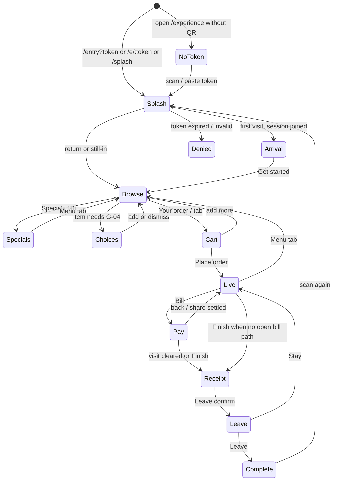
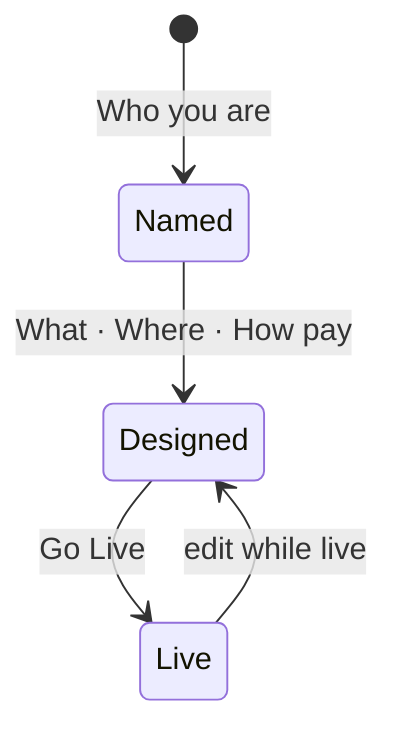
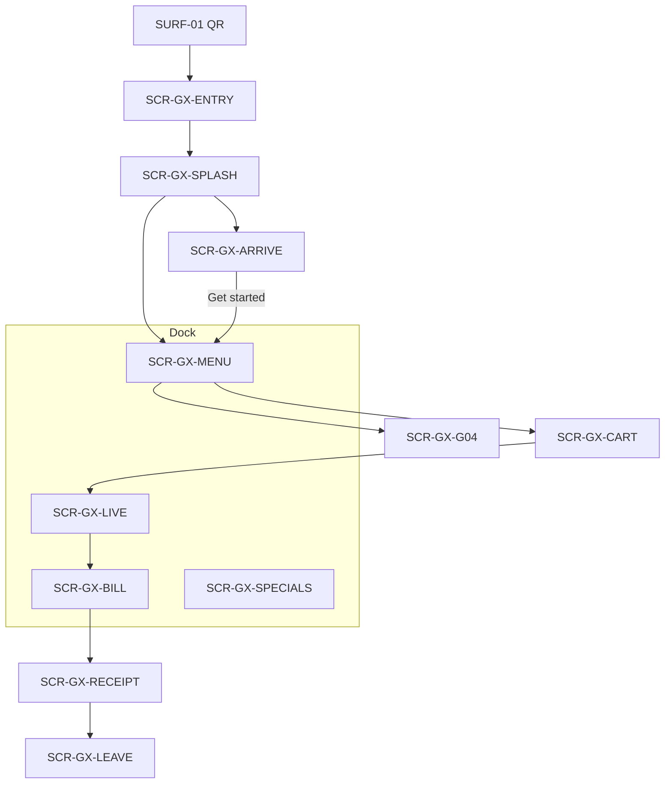
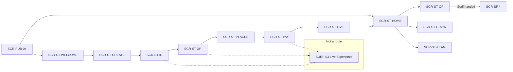
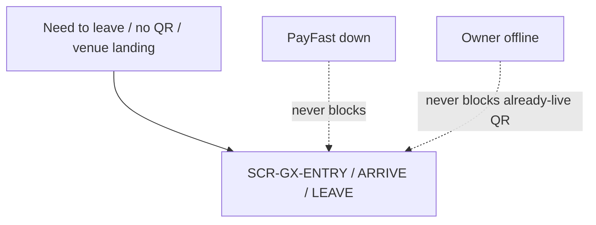

# LEOS — Lifecycle & Screen Map

**Status:** Active — describes **running software**, not a second product  
**Board:** [LEKKI-BUILD.md](../LEKKI-BUILD.md) · **HCI lock:** [current-product-state.md](current-product-state.md)  
**IA:** [ia-experience-studio-shells.md](ia-experience-studio-shells.md) · **ADR-004** three humans  
**Stories:** Guest `G-0X` · Studio `S-00`–`S-10` — [stories/](stories/) · [README-studio.md](stories/README-studio.md)

The single place where LEOS is described as a whole rather than one continuity moment at a time. Its job is to expose contradictions that individual stories cannot show: dead routes, screens nobody owns, Studio chrome that can leak into Guest, Staff who can see owner money, and Guest language that still says Lekki after splash.

This map does **not** reopen Setup v1, invent Marketplace or Neo, or add LEKs. Frozen surfaces stay frozen. Hold items stay Hold.

---

## How this file relates to the stories

References are **one-way**. This map cites story IDs (`G-05`, `S-02`, HCI moment names). Stories are not annotated with screen IDs. Inventories now point here so they do not re-open a freeze queue.

Coverage is automated by `pnpm run check:screens` (**GAP-08 closed**). Every `SCR-*` must name an owner (story, HCI moment, or explicit Hold note). Enablers (connectors, Prisma, capability adapters) are exempt by declaration, not by omission.

**Conventions**

| Prefix | Means |
|--------|--------|
| `LS-*` | Lifecycle state (a **session / venue / staff shift**, not a person) |
| `SCR-*` | In-app screen or named Guest phase |
| `SURF-*` | Off-app or chrome that is not a route |
| `GAP-*` | Hole found by building this map |

Areas: `PUB` public site · `GX` Guest Experience · `ST` Studio · `SF` Staff · `PAY` money · `SET` settings/integrations.

---

## 1. Lifecycle state machines

LEOS is three humans. Mixing their states is how Guest sees Setup and Kitchen sees Grow.

### 1.1 Guest visit (Experience)

States describe **this QR visit**, not an account. Guests have no Lekki login. Identity is a first name on the session plus a returning cookie LEOS remembers.



| ID | State | Meaning | In software |
|----|--------|---------|-------------|
| LS-GX-NONE | No token | Opened Experience without a place | `entry.page` missing |
| LS-GX-SPLASH | Splash | Lekki mark · 4s · tap skip | `/splash` · `GUEST_SPLASH_MAX_MS` |
| LS-GX-ARRIVAL | Arrival | Venue wash · logos · place · Get started | `guest.page` `phase === 'arrival'` |
| LS-GX-SPECIALS | Specials | Tonight’s picks | `phase === 'specials'` |
| LS-GX-BROWSE | Browse | Menu | `phase === 'browse'` |
| LS-GX-CHOICES | Choices | G-04 sheet | overlay on browse |
| LS-GX-CART | Cart | Review before place | `phase === 'cart'` |
| LS-GX-LIVE | Live | Order received · timeline | `phase === 'live'` |
| LS-GX-PAY | Pay | Bill · Mine · Visit · Equal | `phase === 'payment'` |
| LS-GX-RECEIPT | Receipt | Finished this visit | `phase === 'receipt'` |
| LS-GX-LEAVE | Leave confirm | Open balance warning | `phase === 'leave'` |
| LS-GX-DONE | Complete | Back at Entry | `/entry?done=1` |
| LS-GX-DENIED | Denied | Expired / unknown QR | Entry error |

**Join happens during splash** (`resolveEntry`), not on Arrival. Arrival answers *Am I in the right place?* after the session already exists. That is a continuity fact, not a second Join screen.

| Event | From → To | Owner | Notes |
|-------|-----------|--------|--------|
| Scan QR | * → Splash | G-01 Entry · HCI Arrival | Canonical `/entry?token=` |
| Splash hold / tap | Splash → Arrival or Browse | G-01 | Return / still-in skip Arrival |
| Get started | Arrival → Browse | G-01 | Menu, not Specials |
| Add with choices | Browse → Choices → Browse | G-04 | |
| Place order | Cart → Live | G-05 · G-06 | |
| Open bill | Live → Pay | G-07 · Pay Continuity | Hidden if `payAtTable` off or payments inactive |
| Leave | Receipt → Done | G-09 | Open-balance copy |
| Scan again | Done → Splash | Return HCI | `welcome=back` |

**Invariant.** Guest payment (PayFast) never changes **venue** state. A failed or cancelled pay never archives the place and never deletes the session.

### 1.2 Venue / experience (Studio object)



| ID | State | Meaning |
|----|--------|---------|
| LS-VENUE-NAMED | Named | Identity saved, not public |
| LS-VENUE-READY | Ready | Setup story complete enough to Go Live |
| LS-VENUE-LIVE | Live | QR public · same shell as Live Experience |
| LS-VENUE-PAUSED | *(none)* | **GAP-10** — no “close tonight” state |

Go Live does not clone a preview. Public Guest **is** the Live Experience shell ([live-experience.md](live-experience.md)).

### 1.3 Owner (Studio)

| ID | State | Meaning |
|----|--------|---------|
| LS-ST-OUT | Signed out | `/signin` |
| LS-ST-EMPTY | Signed in, no experience | Welcome / Create |
| LS-ST-SETUP | In Setup engine | Identity → Go Live |
| LS-ST-HOME | Live or ready Home | `/studio` |

Setup step **order** is frozen. Depth on Identity (landing colour) is allowed; a sixth Setup step is not.

### 1.4 Staff shift

| ID | State | Meaning |
|----|--------|---------|
| LS-SF-PIN | PIN / login | `/staff` |
| LS-SF-WORK | In assigned Experience | Kitchen · Bar · Floor · Counter |
| LS-SF-MONITOR | Owner watching Staff | `?monitor=1` from Operate |
| LS-SF-IDLE | Device idle | Team · End now |

TTL: staff token **12h** (`StaffTokenService`). Shared device.

---

## 2. Role by surface

| Role | Shell | May see | Must never see |
|------|--------|---------|----------------|
| Guest | Experience | Venue name · place · menu · bill · help | Lekki after splash · Studio · Pack · connector names · kitchen tickets |
| Owner / manager | Studio | Setup · Home · Operate overview · Grow · Team · Live phone | Forced kitchen chrome for oversight |
| Kitchen / Bar | Staff station | That station’s tickets | Grow · Setup payments secrets · other station (unless `staff`) |
| Waiter / Floor | Staff service | Places · ready · help | Payment connector vault |
| Counter | Staff station | Counter queue | Guest PII beyond the ticket |
| POS / Staff participant on Guest session | *(runtime)* | Filtered out of guest name chips | Appearing as a diner |

Staff permissions refine **Experience assignment** first (`studio-team.page` · ADR-004). Fulfilment API enforces station access; serve roles may only mark delivered.

**What each role sees in Guest vs Operate**

| State | Guest | Owner Operate | Kitchen |
|-------|--------|---------------|---------|
| Order placed | Timeline “we’ve got it” | Preparing count | Ticket |
| Ready | Ready banner | Ready count | Ticket leaves / serve |
| Help | Help sheet ack | Needs you | — |
| Pay | Bill · remaining | Payments pulse, not a ledger BI wall | — |
| Leave | Receipt · Leave | Place may still be occupied | — |

**Gap this exposes.** None open in GAP-01…GAP-08 — see §8.

---

## 3. Screen inventory

Tier is not a Lekki paywall. **Free** = always in product. **Hold** = constitution Never / Later. **Never gated** = must render even if payments are down, catalogue is empty, or the owner is mid-Setup (Guest safety / leave / help).

### 3.1 Public (not Guest, not Studio)

| ID | Screen | Route | Entry | Stories | Offline |
|----|--------|-------|-------|---------|---------|
| SCR-PUB-01 | Marketing home | `/` | Direct | Craft / landing | Needs network |
| SCR-PUB-02 | Privacy | `/privacy` | Footer | Legal | Cached |
| SCR-PUB-03 | Terms | `/terms` | Footer | Legal | Cached |
| SCR-PUB-04 | Studio sign-in | `/signin` | Home · deep link | S-00 adjacent | Needs network |

### 3.2 Guest — routes

| ID | Screen | Route | Entry | Stories | Never gated |
|----|--------|-------|-------|---------|-------------|
| SCR-GX-ENTRY | Entry / join name | `/entry` · `/e/:token` | QR | G-01 · G-02 | Yes — must explain missing QR |
| SCR-GX-SPLASH | Lekki splash | `/splash` | After resolve | G-01 | Yes |
| SCR-GX-ONB | Legacy onboarding | `/onboarding` | Old links | Redirect only | n/a |
| SCR-GX-SCAN | Scan helper | `/scan` | Demo `?demo=1` | Engineering only | No — not production join |
| SCR-GX-SHELL | Experience heartbeat | `/experience` · `/guest` | After splash | G-03…G-09 | — |

### 3.3 Guest — phases inside `/experience` (screens, not routes)

| ID | Screen | Phase / overlay | Stories | Never gated |
|----|--------|-----------------|---------|-------------|
| SCR-GX-ARRIVE | Venue landing | `arrival` | G-01 · HCI Arrival | Yes |
| SCR-GX-SPECIALS | Specials | `specials` | Specials Continuity | No — tab off if design.specials false |
| SCR-GX-MENU | Menu | `browse` | G-03 | Yes — empty catalogue still a place |
| SCR-GX-G04 | Choices sheet | overlay | G-04 | Yes when item requires it |
| SCR-GX-CART | Cart | `cart` | G-05 | Yes |
| SCR-GX-LIVE | Orders | `live` | G-06 | Yes |
| SCR-GX-BILL | Bill | `payment` | G-07 · tip/pay continuity | Hidden if pay off |
| SCR-GX-RECEIPT | Finished | `receipt` | G-08 | Yes |
| SCR-GX-LEAVE | Leave confirm | `leave` | G-09 · leave-open | Yes |
| SCR-GX-HELP | Help sheet | overlay | Help Continuity | Hidden if callStaff off |
| SCR-GX-NONE | Scan the QR at your place | no session | E1.S2 · G-01 | Yes |

Dock: **Specials · Menu · Orders · Bill · Help** (Help in overflow when on). Leave is not a fifth competing gold; it lives in the finished moment.

### 3.4 Studio — Setup engine (frozen order)

| ID | Screen | Route | Stories | Live phone mode |
|----|--------|-------|---------|-----------------|
| SCR-ST-WELCOME | Welcome | `/studio/welcome` | S-00 | Optional |
| SCR-ST-CREATE | Choose Experience | `/studio/create` | S-01 | Shell |
| SCR-ST-ID | Who you are | `/studio/setup/identity` | S-02 | **Arrival** (venue landing) |
| SCR-ST-XP | What guests experience | `/studio/setup/experience` | S-03 | Guest shell |
| SCR-ST-PLACES | Where they join | `/studio/setup/places` | S-04 | Arrival |
| SCR-ST-PAY | How they pay | `/studio/setup/payments` | S-05 | Pay |
| SCR-ST-PF | PayFast connect | `/studio/setup/payments/connect` | S-05 · capability | Pay |
| SCR-ST-LIVE | Go Live | `/studio/setup/golive` | S-06 | Public shell |

Live Experience is **not** a nav item (S-10).

### 3.5 Studio — after Go Live

| ID | Screen | Route | Stories |
|----|--------|-------|---------|
| SCR-ST-HOME | Home | `/studio` | S-07 |
| SCR-ST-OP | Operate | `/studio/operate` | S-08 |
| SCR-ST-GROW | Grow | `/studio/grow` | S-09 |
| SCR-ST-TEAM | Team | `/studio/team` | S-11 |
| SCR-ST-MENU | Catalogue | `/studio/menu` | S-12 |
| SCR-ST-PILOT | Pilot POS | `/studio/integrations/pilot` | S-05 · capability |

Integrations hub `/studio/integrations` **redirects** to How they pay (S-05). PayFast connect is `/studio/setup/payments/connect`.

### 3.6 Staff

| ID | Screen | Route | Stories / evidence |
|----|--------|-------|-------------------|
| SCR-SF-PIN | Staff entry | `/staff` | operate-staff-accounts |
| SCR-SF-FLOOR | Floor / waiter | `/staff/service` | S-08 handoff |
| SCR-SF-STATION | Kitchen · Bar · Counter | `/staff/station/:id` | Pack station access |

### 3.7 Dead Studio pages (GAP-01 — closed)

Deleted 2026-09-21 (plus integrations hub with GAP-06). Redirects remain. Do not restore: `studio-live` · `setup-golive` (non-engine) · `setup-hub` · `studio-configure` · `studio-choose` · `setup-organisation` · `setup-integrations`.

Proof: [studio-dead-pages.md](evidence/studio-dead-pages.md) · [payments-one-door.md](evidence/payments-one-door.md)

`NeoDockComponent` is still unimported. Constitution: Neo is Hold (**GAP-02 Hold locked**).

---

## 4. Off-app surfaces

Not screens. Own failure modes. Treating them as Studio pages is how QR becomes an admin artifact.

| ID | Surface | Actions | Owner | Privacy / rule |
|----|---------|---------|--------|----------------|
| SURF-01 | Printed / table QR | Opens Guest | S-06 · G-01 | Token is the place; no Studio URL |
| SURF-02 | LAN origin | Phone on same Wi‑Fi | Go Live copy | `192.168.x` in runtime log |
| SURF-03 | Live Experience phone | Always-on Studio chrome | S-10 | Same meaning as Guest; lighter pixels OK until parity complete |
| SURF-04 | Live Experience fullscreen | View larger | S-10 | Same |
| SURF-05 | PayFast hosted checkout | Card | G-07 · PaymentCapability | Guest leaves LEOS; return/cancel query |
| SURF-06 | Horizon / boot hills | First paint | index.html | No Lekki wordmark on boot |
| SURF-07 | PWA / home screen | Re-open last | ngsw | Must not dump Guest into Studio |
| SURF-08 | PayFast ITN / vault | Server | Payments architect | Owner Studio never shows PAN |

---

## 5. Navigation map

### Guest (one shell)



Guest **never** gets a Studio tab bar. Specials is a Guest tab, not a Setup step.

### Studio (story nav + permanent phone)



### Never-gated Guest paths (audit in one place)

These must not depend on PayFast, catalogue lock, or Studio being open:

- SCR-GX-ENTRY missing token  
- SCR-GX-SPLASH  
- SCR-GX-ARRIVE  
- SCR-GX-LEAVE / SCR-GX-RECEIPT  
- SCR-GX-HELP when the owner turned Help on  

If payments are down: hide Bill, **do not** block Leave or Menu.



Lekki has **no** consumer paywall. Do not add `SCR-PAY-*` subscription screens (constitution Never). Venue **taking payment** is SCR-GX-BILL + SURF-05.

---

## 6. Screens that split oversized stories

| Story | Screens it actually contains | Split if estimated again |
|-------|------------------------------|--------------------------|
| S-02 Who you are | Name · location · logos · Tailwind wash · arrival copy · Live Arrival | Identity facts vs Arrival look (same step, two clusters — do not add a Setup step) |
| S-05 Payments | Methods toggles + PayFast connect + Live pay phone | Human methods vs connector install |
| G-07 Payment | Visit / Mine / Equal · tip · vault · PayFast hop | Already crafted as continuity; do not invent an allocation wizard |
| `/experience` | Ten phases + three overlays | One route is correct; inventory must stay phase-based |
| S-08 Operate | Overview + Staff handoff | Overview stays Studio; floor stays `/staff` |

---

## 7. Wireframe detail: confidence-critical screens

Detail only where getting it wrong costs a first impression, a table, or money.

### 7.1 SCR-GX-SPLASH — Lekki, then never again

```text
┌─────────────────────────────┐
│         (dusk hills)        │
│                             │
│            [mark]           │
│           Lekki.            │
│   The human experience app. │
│                             │
│         tap to skip         │
└─────────────────────────────┘
```

Rules: 4s max. Gold mark, not teal. After this, Guest chrome is **venue `--brand`**. No Lekki wordmark on Arrival or Menu.

### 7.2 SCR-GX-ARRIVE — Am I in the right place?

```text
┌─────────────────────────────┐
│     (venue colour wash)     │
│                             │
│          [logo(s)]          │
│         Blue Door           │
│         Table 12            │
│        Waterfront           │
│                             │
│                             │
│      [  Get started  ]      │
└─────────────────────────────┘
```

Rules: one primary (Get started → Menu). Place spoken once — do not repeat it as the location line. Cluster + thumb CTA. 280ms appear · 220ms out · press 0.98. Same renderer as Studio Live phone on Identity (`leos-venue-arrival`). No dock. No Lekki.

Owner configures wash / logos / words on **S-02**, sees SURF-03 immediately.

### 7.3 SCR-GX-G04 — Choices sheet

One question: how do you want this? Required groups block Add. Never schema words (capability, SKU).

### 7.4 SCR-GX-BILL

Mine · Visit · Equal. Remaining visible. Confirm trust before SURF-05. Cancel returns with nothing taken. Never a Lekki subscription wall.

### 7.5 SCR-ST-ID + SURF-03

Left: Who you are (including Arrival look). Right: phone **is** Arrival, not a canvas. Autosave. No Save/Apply row. Peak gold remains **Open for guests** on Go Live, not every Identity swatch.

### 7.6 SCR-ST-LIVE — Go Live

QR is the doorway. Download · Open Experience. No second preview button.

### 7.7 SCR-SF-STATION

Tickets for **this** station. Owner monitor mode must not grant Grow. Serve role cannot complete cook steps.

---

## 8. Gaps

Found by building the map. Each is a hole, not a documentation nicety.

| ID | Gap | Why it matters | Suggested owner |
|----|-----|----------------|-----------------|
| GAP-01 | Unrouted Studio page files | **Closed** — deleted; redirects remain · [studio-dead-pages.md](evidence/studio-dead-pages.md) | Do not restore preview / hub |
| GAP-02 | `leos-neo-dock` unused | **Hold locked** — unimported · coverage fails if wired | Product unlock only |
| GAP-03 | Team / Staff shift story | **Owned** — [S-11-team.md](stories/S-11-team.md) | Keep floor work on `/staff` |
| GAP-04 | Guest Arrival + Splash G-story | **Owned** — [G-01-entry.md](stories/G-01-entry.md) | Join during splash |
| GAP-05 | `/studio/menu` catalogue | **Owned** — [S-12-catalogue.md](stories/S-12-catalogue.md) | Not a sixth Setup step |
| GAP-06 | Integrations hub vs How they pay | **Closed** — hub redirects to S-05; Pilot deep link only · [payments-one-door.md](evidence/payments-one-door.md) | No second payments home |
| GAP-07 | No LS-VENUE-PAUSED | **Hold locked** — no pause product until Operate names it | Do not invent “close tonight” |
| GAP-08 | Mechanical coverage check | **Closed** — `pnpm run check:screens` · [screen-coverage.md](evidence/screen-coverage.md) | Run in CI |
| GAP-09 | Splash joins before Arrival | Documented truth (G-01) | Do not add a second name wall |
| GAP-10 | Live meaning-parity | Blueprint §3A craft | Not a preview product |
| GAP-11 | No Payouts / Feedback / Reports / Marketing / Documents in Grow | **Mostly closed** — Payouts ([S-15](stories/S-15-payouts.md)) · Feedback ([S-16](stories/S-16-feedback.md)) · Answers ([S-17](stories/S-17-reports.md)) · Payment attention ([S-20](stories/S-20-payment-attention.md)) shipped. Marketing/Documents ([S-18](stories/S-18-marketing.md)–[S-19](stories/S-19-documents.md)) remain L0 — each has an unresolved product dependency (promo pricing at checkout; invoice generation/VAT format). | Grow capability, not a BI/admin module. Reach patterns proven: `leos-payouts-sheet`/`leos-feedback-sheet` (fetch-then-preview) and S-17's plain inline-confirm door (no sheet needed when there's nothing to preview). Email is capability-before-vendor: `EmailConnectorDefinition` in `@lekki/contracts`, mirrors `PaymentConnectorDefinition`. |

---

## 9. Contradictions this map resolved

Recorded so the value of maintaining the map is visible.

1. **E1 Welcome vs running Arrival** — Spec: Continue then Join. Software: join in splash, then venue landing, then Get started → **menu**. Map states the running path as source of truth.  
2. **Screen inventory vs HCI 9/9** — Resolved: inventories now say **Running**, not E4 “In build”.  
3. **Live vs Guest** — Forbidden: preview mode. Allowed: lighter projection with the same facts.  
4. **Specials vs Get started** — First Get started goes to **browse**, not Specials (preferSpecialsLanding cleared).  
5. **Paywall** — W2W’s never-gated vs Premium does not apply. Lekki’s analog is **PayFast down must not trap a diner**.  
6. **Neo** — Component on disk ≠ product. Hold stands.  
7. **Staff in Studio routes** — Legacy `/studio/kitchen` redirects to `/staff/*`. Floor work is not a Studio tab.

---

## 10. Deliberate never (do not add to this map as screens)

Marketplace UI · Neo chatbot in Setup · Admin BI · loyalty admin · wallet admin · fleet CRUD · extra Setup steps · Guest account wall · Lekki name on the venue experience after splash.

When software changes a route or phase, **update this file in the same change**. Do not back-annotate every story.

---

## 11. Remaining work (aligned to the running app)

Software the guest and owner already have is the board. What is left is **ownership, cleanup, and named continuity** — not a second product.

### Done in the app (do not re-spec)

| Surface | Evidence |
|---------|----------|
| Guest heartbeat | `/splash` · `arrival` · browse · G-04 · cart · live · pay · leave · return |
| Setup v1 | Frozen order · Identity look drives landing |
| Live Experience | Same `leos-venue-arrival` / guest facts — not a preview route |
| Staff stations | `/staff/*` · Studio kitchen URLs redirect |
| Operate · Grow · Team UI | Pages exist · Team **S-11** · Catalogue **S-12** |

### Must happen (named GAPs)

| Priority | Gap | Outcome |
|----------|-----|---------|
| — | **GAP-01…GAP-08** | **Closed or Hold-locked** — see §8 · `pnpm run check:screens` · `gap-01-08.test.ts` |
| Hold | GAP-09 · GAP-10 · Marketplace · Neo UI | Join-during-splash truth · Live meaning-parity · Product unlock |

### Docs vs app (this pass)

Inventories, E1 header, IA Guest flow, constitution dock, Experience Backlog, and current-product-state Arrival now match routes/phases. Historical wireframe **boxes** stay as archaeology.

---

## 12. How we build — vertical slices

One complete **user journey** at a time. A slice is a walk a human can finish without us switching layers mid-way (docs, then Staff, then catalogue).

**Done** when: the path answers one question per screen, Studio configures what Guest/Staff see (if the journey has owner look), Live Experience shows the same facts, a story owns it, and there is a walk with evidence. Hygiene (dead files, coverage scripts) rides at the **end** of a slice or waits — it is not a product.

Do **not** work leftover GAPs in parallel as a backlog. That is horizontal.

| Slice | Human walk | In software | Remaining in this slice |
|-------|------------|-------------|-------------------------|
| **Guest first impression** | Scan → splash → landing → Get started → menu | **Owned** · G-01 | Keep the walk. Do not reopen E1 Join. |
| Guest visit (rest) | Menu → choices → cart → live → pay → leave → return | Running · HCI 9/9 | Continuity polish only if named. |
| Owner go-live | Sign in → Setup v1 → QR on the table | Running · Setup frozen | Keep frozen. |
| **Owner catalogue** | Edit what guests browse | **Owned** · S-12 | Phone on `/studio/menu` is browse. |
| Dead Studio pages | Unrouted leftovers | **Closed** · GAP-01 | Do not restore. |
| Payments one door | Hub → How they pay | **Closed** · GAP-06 | Pilot deep link only. |
| Coverage | Map vs routes / stories | **Closed** · GAP-08 | `check:screens`. |
| **Staff shift** | Team assign → PIN → station tickets | **Owned** · S-11 | Keep `/staff/*`. Do not reopen Setup. |
| Pay the bill | Open Bill → confirm → PayFast → back | Inside Guest visit | Not a separate product. |

**Current North Star → Current slice → Status → Next action → Stop.**
